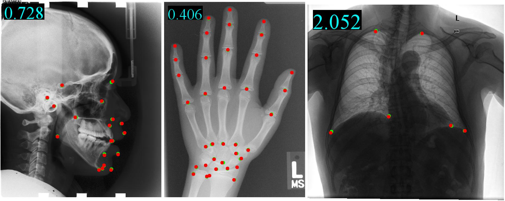

# YOLO_Universal_Anatomical_Landmark_Detection [arXiv](https://arxiv.org/pdf/2103.04657)

PyTorch implementation for learning a universal model for anatomical landmark detection on mixed datasets.


[You Only Learn Once: Universal Anatomical Landmark Detection](https://github.com/ICT-MIRACLE-lab/YOLO_Universal_Anatomical_Landmark_Detection)  
 [Heqin Zhu](https://github.com/mbinary),  [Qingsong Yao](https://github.com/qsyao), [Li Xiao](http://miracle.ict.ac.cn/?page_id=151&lang=zh), [S. Kevin Zhou](http://miracle.ict.ac.cn/?page_id=151&lang=zh)  
Key Lab of Intelligent Information Processing of Chinese Academy of Sciences (CAS), Institute of Computing Technology, CAS
In MICCAI 2021.

## Abstract
Detecting anatomical landmarks in medical images plays an essential role in understanding the anatomy and planning automated processing. In recent years, a variety of deep neural network methods have been developed to detect landmarks automatically. However, all of those methods are unary in the sense that a highly specialized network is trained for a single task say associated with a particular anatomical region. In this work, for the first time, we investigate the idea of “You Only Learn Once (YOLO)” and develop a universal anatomical landmark detection model to realize multiple landmark detection tasks with end-to-end training based on mixed datasets. The model consists of a local network and a global network: The local network is built upon the idea of universal U-Net to learn multi-domain local features and the global network is a parallelly-duplicated sequential of dilated convolutions that extract global features to further disambiguate the landmark locations. It is worth mentioning that the new model design requires much fewer parameters than models with standard convolutions to train. We evaluate our YOLO model on three X-ray datasets of 1,588 images on the head, hand, and chest, collectively contributing 62 landmarks. The experimental results show that our proposed universal model behaves largely better than any previous models trained on multiple datasets. It even beats the performance of the model that is trained separately for every single dataset.

## Prerequisites
- Linux
- NVIDIA GPU 
- python3.5+

## Getting Started
### Installation
- Install python packages`
```bash
pip3 install -r requirements.txt
```

- Clone this repo:
```bash
git clone https://github.com/ICT-MIRACLE-lab/YOLO_Universal_Anatomical_Landmark_Detection
```

### Preparing Datasets
Download the [head](http://www-o.ntust.edu.tw/~cweiwang/ISBI2015/challenge1/), [hand](https://ipilab.usc.edu/research/baaweb), [chest](https://www.kaggle.com/nikhilpandey360/chest-xray-masks-and-labels) datasets.

Prepare datasets in the following directory structure.

* data 
    * ISBI2015\_ceph       # head
    	* 400\_junior
    	* 400\_senior
    	* raw
    		* \*.bmp
    * hand
    	* all.csv # [download here](https://github.com/christianpayer/MedicalDataAugmentationTool-HeatmapRegression/blob/master/hand_xray/hand_xray_dataset/setup/all.csv)
    	* jpg
    	    * \*.jpg
    * chest
    	* pngs        
    	    * CHNCXR_\*.png
    	* labels
    	    * CHNCXR\_\*.txt   # unzip [chest_labels.zip](data/chest_labels.zip)
* universal\_landmark\_detection  # working directory

Now , `cd uinversal_landmark_detection`.

### Usage
```bash
usage: main.py [-h] [-C CONFIG] [-c CHECKPOINT] [-g CUDA_DEVICES] [-m MODEL]
               [-l LOCALNET] [-n NAME_LIST [NAME_LIST ...]] [-e EPOCHS]
               [-L LR] [-w WEIGHT_DECAY] [-s SIGMA] [-x MIX_STEP] [-u] -r
               RUN_NAME -d RUN_DIR -p {train,validate,test}

optional arguments:
  -h, --help            show this help message and exit
  -C CONFIG, --config CONFIG
  -c CHECKPOINT, --checkpoint CHECKPOINT
                        checkpoint path
  -g CUDA_DEVICES, --cuda_devices CUDA_DEVICES
  -m MODEL, --model MODEL
  -l LOCALNET, --localNet LOCALNET
  -n NAME_LIST [NAME_LIST ...], --name_list NAME_LIST [NAME_LIST ...]
  -e EPOCHS, --epochs EPOCHS
  -L LR, --lr LR
  -w WEIGHT_DECAY, --weight_decay WEIGHT_DECAY
  -s SIGMA, --sigma SIGMA
  -x MIX_STEP, --mix_step MIX_STEP
  -u, --use_background_channel
  -r RUN_NAME, --run_name RUN_NAME
  -d RUN_DIR, --run_dir RUN_DIR
  -p {train,validate,test}, --phase {train,validate,test}
```

### Train
- Train a U-Net model
```bash
python3 main.py -d ../runs -r unet2d_runs -p train -m unet2d -e 100
```

- Train our GU2Net model
```bash
python3 main.py -d ../runs -r GU2Net_runs -p train -m gln -l u2net -e 100
```

- Loading checkpoint
```bash
python3 main.py -d ../runs -r GU2Net_runs -p train -m gln -l u2net -e 100 -c CHECKPOINT_PATH
```
This running results are in the following directory structure.

* ../runs 
    * GU2Net\_runs
    	* network_graph.txt
    	* config_train.yaml
    	* config_origin.yaml
    	* learning_rate.png
    	* loss.png
    	* checkpoints
    		* best\_GU2Net\_runs\_\*.pt
        * results
        	* train_epoch
        	* test_epoch

### Test
After training, it will automatically run the tests.

Yet you could manually run the tests:
```bash
python3 main.py -d ../runs -r GU2Net_runs -p test -m gln -l u2net -c CHECKPOINT_PATH
```

### Evaluation
```bash
python3 evaluation.py -i ../runs/GU2Net_runs/results/test_epochxxx
```

### Example
1. Download checkpoint: [Google Drive](https://drive.google.com/file/d/1yQLjZTCqn_fWzyPPJSRxFycrnIoe4U3U/view?usp=sharing)|[蓝奏云](https://wwa.lanzoui.com/i90Dct8u0jg)
2. Unzip it in `YOLO_Universal_Anatomical_Landmark_Detection/universal_landmark_detection`
3. Run commands:
```shell
python3 main.py -d ../runs -r GU2Net -p test -C config.yaml -m gln -l u2net -n chest cephalometric hand -c best.pt
python3 evaluation.py -i ../runs/GU2Net/results/test_epoch067
```

## Citation
```
@inproceedings{zhu2021you,
  title={You only Learn Once: Universal Anatomical Landmark Detection},
  author={Zhu, Heqin and Yao, Qingsong and Xiao, Li and Zhou, S. Kevin},
  booktitle={International Conference on Medical Image Computing and Computer-Assisted Intervention},
  pages={85--95},
  year={2021},
  organization={Springer}
}
```

## Acknowledgments
The yamlConfig.py is modified from [adn](https://github.com/liaohaofu/adn) and unet2d.py is modified from  [PyTorch-UNet](https://github.com/milesial/Pytorch-UNet). 
